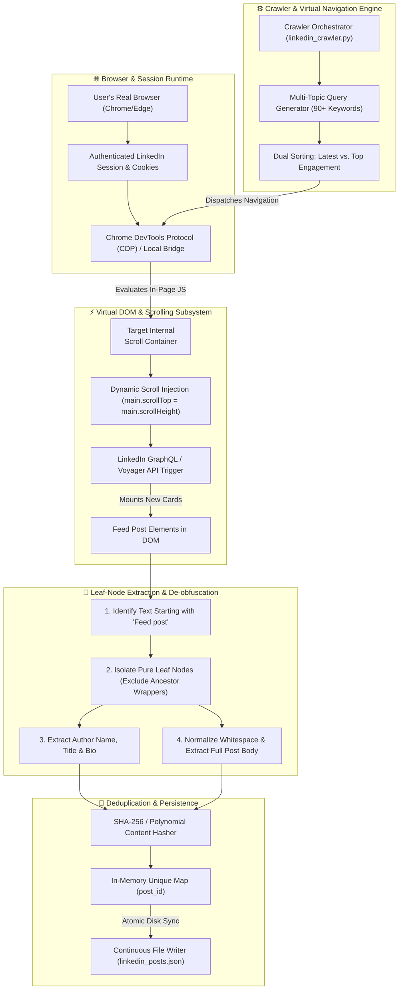

# 🕷️ LinkedIn Post Scraper & JSON Extractor

> **⚡ Fast, autonomous LinkedIn post crawler & structured JSON extractor with virtual DOM `<main>` container scrolling, semantic leaf node extraction, and built-in deduplication.**

[](https://www.python.org/)
[](LICENSE)
[]()
[]()

---

### 📌 Short Description
**A lightweight, beginner-friendly Python tool that hooks into an active browser session to harvest public LinkedIn posts across custom keywords or multi-topic research streams directly into clean, structured JSON.** Solves LinkedIn infinite-scroll traps, ignores useless URL pagination params, and handles full text, author, and timestamp extraction with zero external package installations.

---

## 🌟 Key Highlights

- 🟢 **Zero Config & Beginner Friendly**: Run with a single command or interactive CLI.
- ⚡ **Virtual Scroll & DOM Leaf Extraction**: Solves LinkedIn's inner `<main>` container scroll trapping and bypasses obfuscated CSS classes.
- 🔄 **Multi-Topic & Filter Rotation**: Automatically switches between date-sorted (`sortBy=date_posted`) and relevance rankings across dozens of search keywords.
- 🛡️ **Zero External Python Packages**: Built 100% on Python standard libraries (`urllib`, `json`, `time`, `argparse`).
- 💾 **Deduplication Engine**: Built-in cryptographic hashing prevents duplicate posts across multiple runs and resumes seamlessly.

---

## 🏗️ Architecture & How It Works



---

### 🔬 Deep-Dive: The 4 Core Engineering Breakthroughs

#### 1. Overcoming the `<main>` Virtual Scroll Trap
Most traditional scrapers attempt to scroll the page using `window.scrollBy(0, 1000)` or `document.body.scrollHeight`. On modern LinkedIn, **this completely fails and hangs indefinitely**. 

- **The Problem**: LinkedIn locks the browser viewport (`document.body` is fixed at `100vh`). The actual feed items live inside an internal `<main>` scroll container with `overflow-y: auto`.
- **Our Solution**: The scraper directly measures and manipulates `document.querySelector('main').scrollTop = document.querySelector('main').scrollHeight`. This triggers the underlying `IntersectionObserver` that requests the next page batch from LinkedIn's internal feed APIs.

```javascript
// Injected directly into the active browser runtime
let main = document.querySelector('main') || document.body;
main.scrollTop = main.scrollHeight;
await new Promise(resolve => setTimeout(resolve, 700));
```

---

#### 2. Semantic Leaf-Node Isolation (Immunity to Dynamic CSS Classes)
LinkedIn obfuscates its frontend styling using dynamic webpack class hashes (such as `_1444193b _55bd2b5e e6bf7c20`). Hardcoded CSS selectors like `.feed-shared-update-v2` break with every site update.

- **The Problem**: CSS class selectors are brittle and break frequently. Ancestor containers also bundle multiple child posts together, causing duplicates and malformed text.
- **Our Solution**: We use a two-pass **Semantic Leaf Node Algorithm**:
  1. Find all DOM elements whose `.innerText` begins with the platform's post delimiter (`"Feed post"`).
  2. Filter out all ancestor elements that contain other matching elements:
  
```javascript
let allDivs = Array.from(document.querySelectorAll('div, li, article'))
                   .filter(d => (d.innerText || '').startsWith('Feed post'));

// Keep ONLY the innermost leaf node containing a single post
let leafPosts = allDivs.filter(fp => !allDivs.some(other => other !== fp && fp.contains(other)));
```

---

#### 3. Bypassing the SPA `&page=X` Pagination Barrier
Many developers assume appending `&page=2` or `&page=3` to LinkedIn search URLs will paginate results.

- **The Fact**: LinkedIn Content Search (`/search/results/content/`) is a pure Single Page Application. It **completely ignores** URL page parameters and returns the exact same initial 8–10 posts every time.
- **Our Solution**: Our crawler combines **Multi-Query Diversity** (rotating across 90+ granular topics and sub-genres) with **Dual-Axis Sorting** (`sortBy="date_posted"` for real-time reverse-chronological posts, and default relevance for high-engagement viral posts). This guarantees hundreds of unique, non-overlapping post sets.

---

#### 4. Idempotent State & Instant Deduplication
- **Deterministic Hashing**: Every extracted post is assigned a deterministic ID derived from its content hash.
- **Fault-Tolerant Resumption**: If you stop the crawler (`Ctrl+C`) and start it again tomorrow, it reads the existing JSON file, skips already-harvested posts, and continues scraping new ones seamlessly.
- **Atomic Disk Synchronization**: The database is synced to disk on every single query batch so no data is lost during unexpected shutdowns.

---

## 🚀 Quick Start Guide (For Complete Beginners)

### 1. Prerequisites
- Python **3.8+** installed.
- Google Chrome or Edge with an active LinkedIn login.
- Browser Bridge / CDP running at `http://127.0.0.1:10086` (or Chrome with remote debugging enabled).

### 2. Clone the Repository
```bash
git clone https://github.com/roshan-pixel/linkedin-post-scraper-json.git
cd linkedin-post-scraper-json
```

### 3. Run the Interactive 1-Click Runner
```bash
python quick_start.py
```
*Follow the interactive prompt to enter your search keyword, desired post count, and output filename!*

---

## 🛠️ CLI Usage & Advanced Commands

You can also run the scraper with custom command-line flags:

```bash
# Scrape 50 posts on Cybersecurity
python linkedin_crawler.py --query "cybersecurity" --limit 50 --output cyber_posts.json

# Scrape 100 posts on Artificial Intelligence
python linkedin_crawler.py --query "Artificial Intelligence" --limit 100 --output ai_posts.json

# Scrape across all default pre-configured threat intelligence topics
python linkedin_crawler.py --limit 500 --output master_dataset.json
```

### CLI Arguments Reference
| Argument | Shorthand | Default | Description |
|:---|:---:|:---:|:---|
| `--query` | `-q` | `None` (Runs multi-topic list) | Specific search query or hashtag to target |
| `--limit` | `-l` | `50` | Maximum number of unique posts to harvest |
| `--output`| `-o` | `scraped_posts.json` | Destination JSON file path |

---

## 📊 Output JSON Schema

Every collected post is stored as a clean, standardized JSON object:

```json
[
  {
    "post_id": "post_184729104",
    "query": "cybersecurity",
    "sort_by": "date_posted",
    "author": "Mandiant Threat Intelligence",
    "preview": "Feed post\n\nMandiant Threat Intelligence\n\n1d • \n\nFollow\n\n🚨 New Analysis...",
    "full_text": "Feed post\n\nMandiant Threat Intelligence\n\n1d • \n\nFollow\n\n🚨 New Analysis: Tracking state-sponsored threat actors exploiting edge perimeter appliances.\n\nOur latest report breaks down evasion techniques observed across critical infrastructure...",
    "collected_at": "2026-08-14T15:30:00.000Z"
  }
]
```

### Fields Explained:
- `post_id`: Unique identifier computed from post content for automatic deduplication.
- `query`: The search topic that discovered the post.
- `sort_by`: The sort filter applied (`date_posted` for latest, `relevance` for top).
- `author`: The name of the author or publishing organization.
- `preview`: Compact text preview for quick scanning.
- `full_text`: Complete post text body without truncations.
- `collected_at`: UTC timestamp of when the post was captured.

---

## 💡 Troubleshooting & FAQs

#### Q1: "Active tab not found" error?
> **Answer**: Ensure your browser is open with LinkedIn loaded in at least one tab, and that your local bridge daemon or Chrome remote debugging port is running.

#### Q2: The scraper stopped before reaching the limit?
> **Answer**: LinkedIn search results for a single exact query string may cap at 30-50 posts. The multi-topic mode automatically rotates queries to reach 1,000+ posts.

#### Q3: Can I add my own custom search topics?
> **Answer**: Yes! Either pass `--query "your keyword"` or edit the `DEFAULT_TOPICS` list in `linkedin_crawler.py`.

---

## 📜 License & Disclaimer

- **License**: MIT License. Free to use, modify, and distribute for educational, research, and open-source projects.
- **Disclaimer**: This tool is for authorized educational and research purposes. Ensure you comply with relevant terms of service and data privacy guidelines when accessing web platforms.
