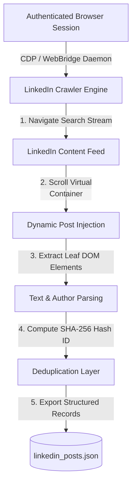

# 🕷️ LinkedIn Post Scraper & JSON Extractor

> **⚡ Fast, autonomous LinkedIn post crawler & structured JSON extractor with virtual DOM `<main>` container scrolling, semantic leaf node extraction, and built-in deduplication.**

[](https://www.python.org/)
[](LICENSE)
[]()
[]()

---

### 📌 Short Description
**A lightweight, beginner-friendly Python tool that hooks into an active browser session to harvest public LinkedIn posts across custom keywords or multi-topic research streams directly into clean, structured JSON.** Solves LinkedIn infinite-scroll traps, ignores useless URL pagination params, and handles full text, author, and timestamp extraction with zero external package installations.

---

## 🌟 Key Highlights

- 🟢 **Zero Config & Beginner Friendly**: Run with a single command or interactive CLI.
- ⚡ **Virtual Scroll & DOM Leaf Extraction**: Solves LinkedIn's inner `<main>` container scroll trapping and bypasses obfuscated CSS classes.
- 🔄 **Multi-Topic & Filter Rotation**: Automatically switches between date-sorted (`sortBy=date_posted`) and relevance rankings across dozens of search keywords.
- 🛡️ **Zero External Python Packages**: Built 100% on Python standard libraries (`urllib`, `json`, `time`, `argparse`).
- 💾 **Deduplication Engine**: Built-in cryptographic hashing prevents duplicate posts across multiple runs and resumes seamlessly.

---

## 🏗️ Architecture & How It Works



### Why Standard Scraping Fails on LinkedIn (And How We Fix It):
1. **The `&page=X` Myth**: LinkedIn's content search (`/search/results/content/`) is an infinite-scroll SPA that completely ignores URL pagination (`&page=2` renders identical results).
2. **Inner `<main>` Scroll Trap**: The outer `window` has a fixed viewport height. Scrolling must be directed to `document.querySelector('main').scrollTop = main.scrollHeight` to trigger dynamic network fetching.
3. **Class Obfuscation**: Modern LinkedIn class names are dynamic hashes (e.g. `_1444193b _55bd2b5e`). Our crawler uses **semantic leaf node matching** based on post text boundaries (`Feed post`), making it immune to UI updates.

---

## 🚀 Quick Start Guide (For Complete Beginners)

### 1. Prerequisites
- Python **3.8+** installed.
- Google Chrome or Edge with an active LinkedIn login.
- Browser Bridge / CDP running at `http://127.0.0.1:10086` (or Chrome with remote debugging enabled).

### 2. Clone the Repository
```bash
git clone https://github.com/roshan-pixel/linkedin-post-scraper-json.git
cd linkedin-post-scraper-json
```

### 3. Run the Interactive 1-Click Runner
```bash
python quick_start.py
```
*Follow the interactive prompt to enter your search keyword, desired post count, and output filename!*

---

## 🛠️ CLI Usage & Advanced Commands

You can also run the scraper with custom command-line flags:

```bash
# Scrape 50 posts on Cybersecurity
python linkedin_crawler.py --query "cybersecurity" --limit 50 --output cyber_posts.json

# Scrape 100 posts on Artificial Intelligence
python linkedin_crawler.py --query "Artificial Intelligence" --limit 100 --output ai_posts.json

# Scrape across all default pre-configured threat intelligence topics
python linkedin_crawler.py --limit 500 --output master_dataset.json
```

### CLI Arguments Reference
| Argument | Shorthand | Default | Description |
|:---|:---:|:---:|:---|
| `--query` | `-q` | `None` (Runs multi-topic list) | Specific search query or hashtag to target |
| `--limit` | `-l` | `50` | Maximum number of unique posts to harvest |
| `--output`| `-o` | `scraped_posts.json` | Destination JSON file path |

---

## 📊 Output JSON Schema

Every collected post is stored as a clean, standardized JSON object:

```json
[
  {
    "post_id": "post_184729104",
    "query": "cybersecurity",
    "sort_by": "date_posted",
    "author": "Mandiant Threat Intelligence",
    "preview": "Feed post\n\nMandiant Threat Intelligence\n\n1d • \n\nFollow\n\n🚨 New Analysis...",
    "full_text": "Feed post\n\nMandiant Threat Intelligence\n\n1d • \n\nFollow\n\n🚨 New Analysis: Tracking state-sponsored threat actors exploiting edge perimeter appliances.\n\nOur latest report breaks down evasion techniques observed across critical infrastructure...",
    "collected_at": "2026-08-14T15:30:00.000Z"
  }
]
```

### Fields Explained:
- `post_id`: Unique identifier computed from post content for automatic deduplication.
- `query`: The search topic that discovered the post.
- `sort_by`: The sort filter applied (`date_posted` for latest, `relevance` for top).
- `author`: The name of the author or publishing organization.
- `preview`: Compact text preview for quick scanning.
- `full_text`: Complete post text body without truncations.
- `collected_at`: UTC timestamp of when the post was captured.

---

## 💡 Troubleshooting & FAQs

#### Q1: "Active tab not found" error?
> **Answer**: Ensure your browser is open with LinkedIn loaded in at least one tab, and that your local bridge daemon or Chrome remote debugging port is running.

#### Q2: The scraper stopped before reaching the limit?
> **Answer**: LinkedIn search results for a single exact query string may cap at 30-50 posts. The multi-topic mode automatically rotates queries to reach 1,000+ posts.

#### Q3: Can I add my own custom search topics?
> **Answer**: Yes! Either pass `--query "your keyword"` or edit the `DEFAULT_TOPICS` list in `linkedin_crawler.py`.

---

## 📜 License & Disclaimer

- **License**: MIT License. Free to use, modify, and distribute for educational, research, and open-source projects.
- **Disclaimer**: This tool is for authorized educational and research purposes. Ensure you comply with relevant terms of service and data privacy guidelines when accessing web platforms.
